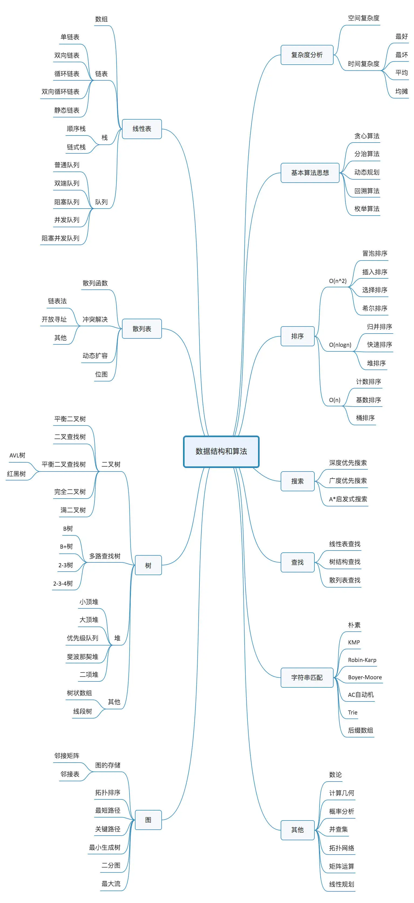

为了考研，为了不惧怕面试，为了找到高薪工作。

<!-- more -->

学习算法，断断续续。
这次想重新拾起，刚好看到有哥们出了这个系列 https://damaer.github.io/CodeSolution/#/ ， 想效仿下。
本次学习有三个目的：
一是应对面试，学了之后，不惧怕大厂的面试，更不惧怕普通公司的面试，有底气了；
二是考西工大软件学院研究生，需要考算法。
三是今年361绩效可能会获得1，如果被辞退了，该如何。

本次学习会参考之前的学习方法。
1）王争老师的  https://time.geekbang.org/column/intro/100017301?tab=catalog
2）他的目录结构和排版  https://damaer.github.io/CodeSolution/#/
3）之前的笔记：
    https://github.com/Changer0914/algorithm014-algorithm014
    印象笔记

算法与数据结构。
数据结构是什么？是计算机存储数据的结构。
算法是什么？计算机擅长做重复的事情，算法就是计算机可识别的重复单元，编程人员就是要训练找出这些重复单元。

## 学习计划

## 分类导航

01. 数据结构基础知识
    数组、链表、跳表、栈、队列、哈希表、位、树、堆、图
02. 几种排序算法

## 思维导图

