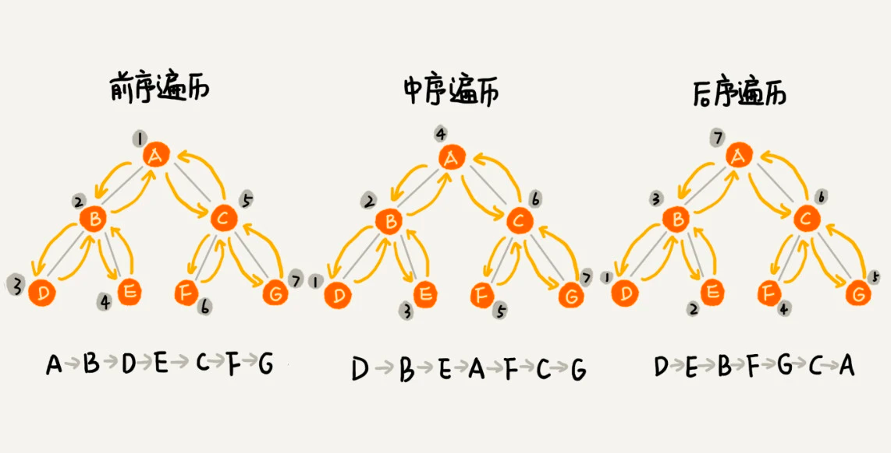

我爱算法。

<!-- more -->

# 数组

# 链表

# 位

# 栈

# 队列

# 树

树
二叉树：每个节点最多有两个子节点。
满二叉树
完全二叉树
平衡二叉树（AVL树）：
红黑树：

## 二叉树的遍历

层次遍历：从上到下、从左到右的遍历。

前序遍历：根节点、左子树、右子树
中序遍历：左子树、根节点、右子树
后序遍历：左子树、右子树、根节点

其实就是根节点的前中后。

# 图

# 堆

