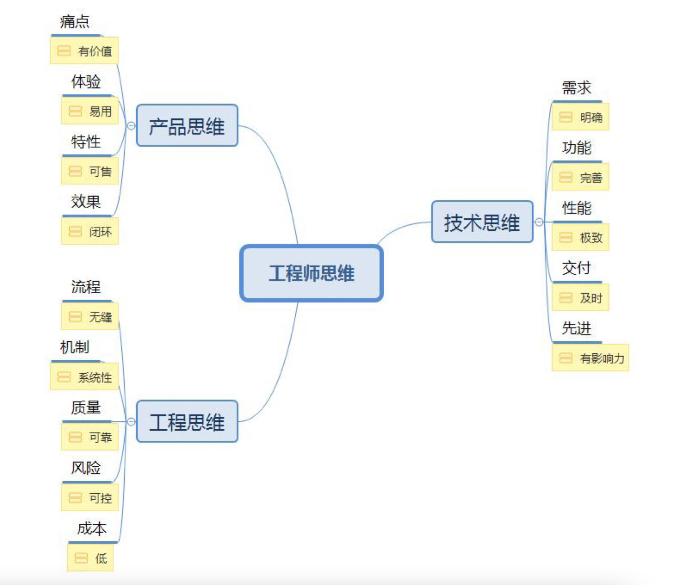

一秒看透问题的本质：U型思考 、第一性原理。

解决说话做事时大脑混乱：技术人的结构化思维。

学习一门技术：内部设计、外部应用 。

做事情、解决问题时，运用1个思考框架（现状、目标、路径）和4个思考原则（以终为始、任务分解、沟通反馈、自动化）。

技术人的三大思维：产品思维、技术思维、工程思维。

<!-- more -->

### 技术人具备“结构化思维”意味着什么？

原文链接：https://developer.aliyun.com/article/709945

**什么是结构化思维？**

那么到底是什么是结构化思维呢？简单来说，结构化思维的定义就是：逻辑+套路。

**表达要有逻辑**

**所谓逻辑是指我们的结构之间必须是有逻辑关系的。**例如，你说话的时候用“第一、第二、第三”这个逻辑顺序是合理的，但是，用“第一，第二，第四”就会显得很奇怪。当然，即使你用了”一、二、三”，也不一定就意味着你的内容有逻辑关系。想让内容有逻辑关系，我们要学会四种组织思想的逻辑关系：

1）**演绎（因果）顺序**：“大前提、小前提、结论”的演绎推理方式就是演绎顺序。比如，经典三段论：所有人都要死，苏格拉底是人，苏格拉底要死。

2）**时间（步骤）顺序**：“第一、第二、第三”，“首先、然后、再者”等，很多的时间顺序同时也是因果顺序。

3）**空间（结构）顺序**：“前端、后端、数据”，“波士顿、纽约、华盛顿”，化整为零（将整体分解为部分）等都是空间顺序。

4）**程度（重要性）顺序**：比如“最重要、次重要、不重要”等。

实际上，所有的逻辑关系都在这四种顺序之内。只要我们的思想和表达在这四种逻辑顺序之内，就是有逻辑的，否则就会显得没有逻辑性。

**做事要有套路**

**套路是指我们解决问题的方法论，这个也非常重要。**比如，5W2H 分析法就是一个非常好的，可以帮助我们分析问题的一个”套路”。试想一下，面对任何一个问题，你都能从 Why、Who、When、Where、What、How 和 How much（如下图所示），七个方面去思考。是不是比不知道这个方法论的人，用点状的思考，5W2H 分析法就全面得多。

### 优秀工程师必备的三大思维，你拥有哪些?

