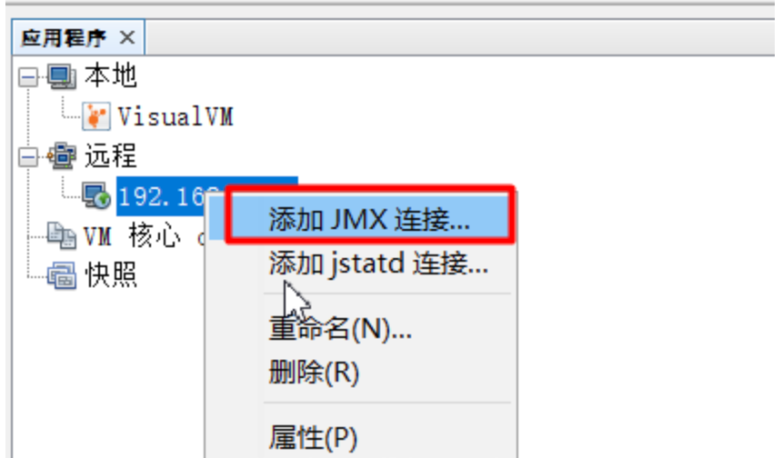

垃圾回收。


<!-- more -->


## 1 知识体系


## 2 问题


### jvm的默认配置


### jvm的内存划分


只有堆内存才有垃圾回收。


### 如何判断是死亡对象


### 垃圾回收算法有哪些


### jdk8默认使用的垃圾收集器

如何查看？


到底是 Parallel Scavenge（新生代）+ Serial Old（老年代）

还是 Parallel Scavenge（新生代） + Parallel Old （老年代） ？？？


#### 如何配置其他垃圾收集器？

在JVM中是+XX配置实现的搭配组合：

UseSerialGC 表示 “Serial” + "Serial Old"组合

UseParNewGC 表示 “ParNew” + “Serial Old”

UseConcMarkSweepGC 表示 “ParNew” + “CMS”. 组合，“CMS” 是针对旧生代使用最多的

UseParallelGC 表示 “Parallel Scavenge” + "Parallel Old"组合

UseParallelOldGC 表示 “Parallel Scavenge” + "Parallel Old"组合

在实践中使用UseConcMarkSweepGC 表示 “ParNew” + “CMS” 的组合是经常使用的


在介绍垃圾收集器之前，需要明确一点，就是在新生代采用的停止复制算法中，“停 止（Stop-the-world）”的意义是在回收内存时，需要暂停其他所 有线程的执行。这个是很低效的，现在的各种新生代收集器越来越优化这一点，但仍然只是将停止的时间变短，并未彻底取消停止。

- Serial收集器：新生代收集器，使用停止复制算法，使用一个线程进行GC，串行，其它工作线程暂停。使用-XX:+UseSerialGC可以使用Serial+Serial Old模式运行进行内存回收（这也是虚拟机在Client模式下运行的默认值）
- ParNew收集器：新生代收集器，使用停止复制算法，Serial收集器的多线程版，用多个线程进行GC，并行，其它工作线程暂停，关注缩短垃圾收集时间。使用-XX:+UseParNewGC开关来控制使用ParNew+Serial Old收集器组合收集内存；使用-XX:ParallelGCThreads来设置执行内存回收的线程数。
- Parallel Scavenge 收集器：新生代收集器，使用停止复制算法，关注CPU吞吐量，即运行用户代码的时间/总时间，比如：JVM运行100分钟，其中运行用户代码99分钟，垃 圾收集1分钟，则吞吐量是99%，这种收集器能最高效率的利用CPU，适合运行后台运算（关注缩短垃圾收集时间的收集器，如CMS，等待时间很少，所以适 合用户交互，提高用户体验）。使用-XX:+UseParallelGC开关控制使用Parallel Scavenge+Serial Old收集器组合回收垃圾（这也是在Server模式下的默认值）；使用-XX:GCTimeRatio来设置用户执行时间占总时间的比例，默认99，即1%的时间用来进行垃圾回收。使用-XX:MaxGCPauseMillis设置GC的最大停顿时间（这个参数只对Parallel Scavenge有效），用开关参数-XX:+UseAdaptiveSizePolicy可以进行动态控制，如自动调整Eden/Survivor比例，老年代对象年龄，新生代大小等，这个参数在ParNew下没有。

- Serial Old收集器：老年代收集器，单线程收集器，串行，使用标记整理（整理的方法是Sweep（清理）和Compact（压缩），清理是将废弃的对象干掉，只留幸存的对象，压缩是将移动对象，将空间填满保证内存分为2块，一块全是对象，一块空闲）算法，使用单线程进行GC，其它工作线程暂停（注意，在老年代中进行标记整理算法清理，也需要暂停其它线程），在JDK1.5之前，Serial Old收集器与ParallelScavenge搭配使用。
- Parallel Old收集器：老年代收集器，多线程，并行，多线程机制与Parallel Scavenge差不错，使用标记整理（与Serial Old不同，这里的整理是Summary（汇总）和Compact（压缩），汇总的意思就是将幸存的对象复制到预先准备好的区域，而不是像Sweep（清理）那样清理废弃的对象）算法，在Parallel Old执行时，仍然需要暂停其它线程。Parallel Old在多核计算中很有用。Parallel Old出现后（JDK 1.6），与Parallel Scavenge配合有很好的效果，充分体现Parallel Scavenge收集器吞吐量优先的效果。使用-XX:+UseParallelOldGC开关控制使用Parallel Scavenge +Parallel Old组合收集器进行收集。
- G1收集器：在JDK1.7中正式发布。
- CMS（Concurrent Mark Sweep）收集器：老年代收集器，致力于获取最短回收停顿时间（即缩短垃圾回收的时间），使用标记清除算法，多线程，优点是并发收集（用户线程可以和GC线程同时工作），停顿小。使用-XX:+UseConcMarkSweepGC进行ParNew+CMS+Serial Old进行内存回收，优先使用ParNew+CMS（原因见后面），当用户线程内存不足时，采用备用方案Serial Old收集。

> CMS收集的执行过程是：初始标记(CMS-initial-mark) -> 并发标记(CMS-concurrent-mark) -->预清理(CMS-concurrent-preclean)-->可控预清理(CMS-concurrent-abortable-preclean)-> 重新标记(CMS-remark) -> 并发清除(CMS-concurrent-sweep) ->并发重设状态等待下次CMS的触发(CMS-concurrent-reset)
>
> 具体的说，先2次标记，1次预清理，1次重新标记，再1次清除。 
>
> 1，首先jvm根据-XX:CMSInitiatingOccupancyFraction，-XX:+UseCMSInitiatingOccupancyOnly来决定什么时间开始垃圾收集；
>
> 2，如果设置了-XX:+UseCMSInitiatingOccupancyOnly，那么只有当old代占用确实达到了-XX:CMSInitiatingOccupancyFraction参数所设定的比例时才会触发cms gc；
>
> 3，如果没有设置-XX:+UseCMSInitiatingOccupancyOnly，那么系统会根据统计数据自行决定什么时候触发cms gc；因此有时会遇到设置了80%比例才cms gc，但是50%时就已经触发了，就是因为这个参数没有设置的原因；
>
> 4，当cms gc开始时，首先的阶段是初始标记(CMS-initial-mark)，是stop the world阶段，因此此阶段标记的对象只是从root集最直接可达的对象；
>
>    CMS-initial-mark：961330K（1572864K），指标记时，old代的已用空间和总空间
>
> 5，下一个阶段是并发标记(CMS-concurrent-mark)，此阶段是和应用线程并发执行的，所谓并发收集器指的就是这个，主要作用是标记可达的对象，此阶段不需要用户停顿。
>
> ​    此阶段会打印2条日志：CMS-concurrent-mark-start，CMS-concurrent-mark
>
> 6，下一个阶段是CMS-concurrent-preclean，此阶段主要是进行一些预清理，因为标记和应用线程是并发执行的，因此会有些对象的状态在标记后会改变，此阶段正是解决这个问题因为之后的Rescan阶段也会stop the world，为了使暂停的时间尽可能的小，也需要preclean阶段先做一部分工作以节省时间
>
>    此阶段会打印2条日志：CMS-concurrent-preclean-start，CMS-concurrent-preclean
>
> 7，下一阶段是CMS-concurrent-abortable-preclean阶段，加入此阶段的目的是使cms gc更加可控一些，作用也是执行一些预清理，以减少Rescan阶段造成应用暂停的时间
>
>    此阶段涉及几个参数：
>
>    -XX:CMSMaxAbortablePrecleanTime：当abortable-preclean阶段执行达到这个时间时才会结束
>
>    -XX:CMSScheduleRemarkEdenSizeThreshold（默认2m）：控制abortable-preclean阶段什么时候开始执行，
>
>    即当eden使用达到此值时，才会开始abortable-preclean阶段
>
>    -XX:CMSScheduleRemarkEdenPenetratio（默认50%）：控制abortable-preclean阶段什么时候结束执行
>
>    此阶段会打印一些日志如下：
>
>    CMS-concurrent-abortable-preclean-start，CMS-concurrent-abortable-preclean，
>
>    CMS：abort preclean due to time XXX
>
> 8，再下一个阶段是第二个stop the world阶段了，即Rescan阶段，此阶段暂停应用线程，停顿时间比并发标记小得多，但比初始标记稍长。对对象进行重新扫描并标记；
>
> ​    YG occupancy：964861K（2403008K），指执行时young代的情况
>
> ​    CMS remark：961330K（1572864K），指执行时old代的情况
>
>    此外，还打印出了弱引用处理、类卸载等过程的耗时
>
> 9，再下一个阶段是CMS-concurrent-sweep，进行并发的垃圾清理
>
> 10，最后是CMS-concurrent-reset，为下一次cms gc重置相关数据结构
>
>  
>
> 有2种情况会触发CMS 的悲观full gc，在悲观full gc时，整个应用会暂停
>
> ​    A，concurrent-mode-failure：预清理阶段可能出现，当cms gc正进行时，此时有新的对象要进行old代，但是old代空间不足造成的。其可能性有：1，O区空间不足以让新生代晋级，2，O区空间用完之前，无法完成对无引用的对象的清理。这表明，当前有大量数据进入内存且无法释放。
>
> ​    B，promotion-failed：新生代young gc可能出现，当进行young gc时，有部分young代对象仍然可用，但是S1或S2放不下，因此需要放到old代，但此时old代空间无法容纳此。
> 
>
> 影响cms gc时长及触发的参数是以下2个：
>
> ​    -XX:CMSMaxAbortablePrecleanTime=5000
>
> ​    -XX:CMSInitiatingOccupancyFraction=80
>
> 解决也是针对这两个参数来的，根本的原因是每次请求消耗的内存量过大
>
> 解决方式：
>
>    A，针对cms gc的触发阶段，调整-XX:CMSInitiatingOccupancyFraction=50，提早触发cms gc，就可以缓解当old代达到80%，cms gc处理不完，从而造成concurrent mode failure引发full gc
>
>    B，修改-XX:CMSMaxAbortablePrecleanTime=500，缩小CMS-concurrent-abortable-preclean阶段的时间
>
>    C，考虑到cms gc时不会进行compact，因此加入-XX:+UseCMSCompactAtFullCollection
>
> ​    （cms gc后会进行内存的compact）和-XX:CMSFullGCsBeforeCompaction=4（在full gc4次后会进行compact）参数
>
>  
>
> 在CMS清理过程中，只有初始标记和重新标记需要短暂停顿，并发标记和并发清除都不需要暂停用户线程，因此效率很高，很适合高交互的场合。
>
> CMS也有缺点，它需要消耗额外的CPU和内存资源，在CPU和内存资源紧张，CPU较少时，会加重系统负担（CMS默认启动线程数为(CPU数量+3)/4）。
>
> 另外，在并发收集过程中，用户线程仍然在运行，仍然产生内存垃圾，所以可能产生“浮动垃圾”，本次无法清理，只能下一次Full GC才清理，因此在GC期间，需要预留足够的内存给用户线程使用。所以使用CMS的收集器并不是老年代满了才触发Full GC，而是在使用了一大半（默认68%，即2/3，使用-XX:CMSInitiatingOccupancyFraction来设置）的时候就要进行Full GC，如果用户线程消耗内存不是特别大，可以适当调高-XX:CMSInitiatingOccupancyFraction以降低GC次数，提高性能，如果预留的用户线程内存不够，则会触发Concurrent Mode Failure，此时，将触发备用方案：使用Serial Old 收集器进行收集，但这样停顿时间就长了，因此-XX:CMSInitiatingOccupancyFraction不宜设的过大。
>
> 还有，CMS采用的是标记清除算法，会导致内存碎片的产生，可以使用-XX：+UseCMSCompactAtFullCollection来设置是否在Full GC之后进行碎片整理，用-XX：CMSFullGCsBeforeCompaction来设置在执行多少次不压缩的Full GC之后，来一次带压缩的Full GC。


### 何时触发young gc 

又叫Minor GC。

创建新对象时会从中分配内存，内存不足时，触发 Young GC。

（当年轻代满时就会触发Minor GC，这里的年轻代满指的是Eden代满，Survivor满不会引发GC。）


### 何时触发full gc

又叫 Major GC。

（1）调用System.gc时，系统建议执行Full GC，但是不必然执行。

执行System.gc()函数的作用只是提醒或告诉虚拟机，希望进行一次垃圾回收。

至于什么时候进行回收还是取决于虚拟机，而且也不能保证一定进行回收（如果-XX:+DisableExplicitGC设置成true，则不会进行回收）。

（2）老年代空间不足

~~（3）方法区空间不足（jdk1.8 方法区不在堆里，所以这里不会触发）~~

（4）Minor GC 对象晋升到老年代 ： 通过Minor GC后进入老年代的平均大小大于老年代的可用内存

（5）由Eden区、survivor space1（From Space）区向survivor space2（To Space）区复制时，对象大小大于To Space可用内存，则把该对象转存到老年代，且老年代的可用内存小于该对象大小


### 内存分析工具 jmap

jmap -heap pid

```
Heap Configuration:
   MinHeapFreeRatio         = 0
   MaxHeapFreeRatio         = 100
   MaxHeapSize              = 6442450944 (6144.0MB)
   NewSize                  = 2147483648 (2048.0MB)   新生代
   MaxNewSize               = 2147483648 (2048.0MB)
   OldSize                  = 4294967296 (4096.0MB)   老年代
   NewRatio                 = 2      新生代和老年代的内存比例
   SurvivorRatio            = 8      新生代中E区和S区的比例（E : 2个S）
   MetaspaceSize            = 21807104 (20.796875MB)
   CompressedClassSpaceSize = 1073741824 (1024.0MB)
   MaxMetaspaceSize         = 17592186044415 MB
   G1HeapRegionSize         = 0 (0.0MB)


Heap Usage:
PS Young Generation
Eden Space:
   capacity = 1938292736 (1848.5MB)
   used     = 1368888040 (1305.4733657836914MB)
   free     = 569404696 (543.0266342163086MB)
   70.6233900883793% used
From Space:
   capacity = 105381888 (100.5MB)
   used     = 82674312 (78.84436798095703MB)
   free     = 22707576 (21.65563201904297MB)
   78.45210744373834% used
To Space:
   capacity = 103809024 (99.0MB)
   used     = 0 (0.0MB)
   free     = 103809024 (99.0MB)
   0.0% used
PS Old Generation
   capacity = 4294967296 (4096.0MB)
   used     = 342100464 (326.25242614746094MB)
   free     = 3952866832 (3769.747573852539MB)
   7.9651471227407455% used
```


### 内存分析工具 MAT


### 自带监控工具 jstat

jstat -gcutil 进程ID 3s


M  元空间的内存使用百分比

O  老年代的内存使用百分比

CCS  Compressed class space utilization as a percentage.


参数解释看文档：https://docs.oracle.com/javase/8/docs/technotes/tools/unix/jstat.html


### 查看线程堆栈 jstack


### 如何进行远程jmx

jar启动参数：这是无认证（不带用户名和密码）的配置

```
-Dcom.sun.management.jmxremote=true
-Djava.rmi.server.hostname=192.168.198.137 
-Dcom.sun.management.jmxremote.port=1919 
-Dcom.sun.management.jmxremote.authenticate=false 
-Dcom.sun.management.jmxremote.ssl=false
```


本地启动：双击`%JAVA_HOME%/bin/jvisualvm.exe` 启动Java VisualVM




### jvm有哪些调节参数，默认值是什么？

可以用 java -XX:+PrintFlagsFinal  查看

### 为何将Xms和Xmx设置一样大？

为了避免堆收缩和扩大时对性能的影响。


### 其他分析工具

开源arthas

阿里ARMS


### 什么是内存泄露？什么是内存溢出？

溢出：你的数据 不能 放到 你申请的空间里。

泄露：你申请的空间，用完后，一直没有被释放。

​	堆内存里的不可达对象 是会被回收的，理论上不存在内存泄露。

### 线程的状态


### 垃圾收集器中的并发与并行

注意并发（Concurrent）和并行（Parallel）的区别：

   **并发**是指用户线程与GC线程同时执行（不一定是并行，可能交替，但总体上是在同时执行的），不需要停顿用户线程（其实在CMS中用户线程还是需要停顿的，只是非常短，GC线程在另一个CPU上执行）；

   **并行**收集是指多个GC线程并行工作，但此时用户线程是暂停的；

所以，Serial是串行的，Parallel收集器是并行的，而CMS收集器是并发的。


## 3 实战

### 追查老配置中心所在服务器的内存报警问题

1、当时的环境

服务器配置：4核8G

jvm配置：jdk版本是1.8，用的是 UseParallelGC 表示 Parallel Scavenge + Parallel Old 组合

  -XX:+UnlockExperimentalVMOptions 

   -XX:+UnlockDiagnosticVMOptions

   -XX:+HeapDumpOnOutOfMemoryError -XX:HeapDumpPath=/home/super/heapdump.hprof

   -Xms6144m -Xmx6144m

2、现象

内存使用率一直往上增，触发报警，然后自动重启。


3、疑问：为何一直没有生成heapdump.hprof文件？

直到昨天涛哥提出，应用应该是被操作系统干掉的，看日志。

```
grep "Out of memory" /var/log/messages
```


4、疑问：为何会重启？

docker配置了重启参数。


5、使用 cms 垃圾器，配置老年代内存达到80%时进行 full gc

-XX:+UseConcMarkSweepGC
-XX:CMSInitiatingOccupancyFraction=80

验证配置是否生效。

看jstat监控：O区使用量不会超过80%了，full gc变得频繁


看jmap


相比使用默认收集器，压测接口吞吐量下降


6、不触发内存报警的方案：

掩耳盗铃式：关闭报警。

最简：增大服务器内存。

修改jvm参数：分析原因。尽快 触发 full gc 。

​	降低堆内存大小。

​	当老年代内存使用率达到一定比例时，触发full gc

优化代码：用时长，风险高。


## 4 参考


1、[Java系列笔记(3) - Java 内存区域和GC机制](https://www.cnblogs.com/zhguang/p/3257367.html)

