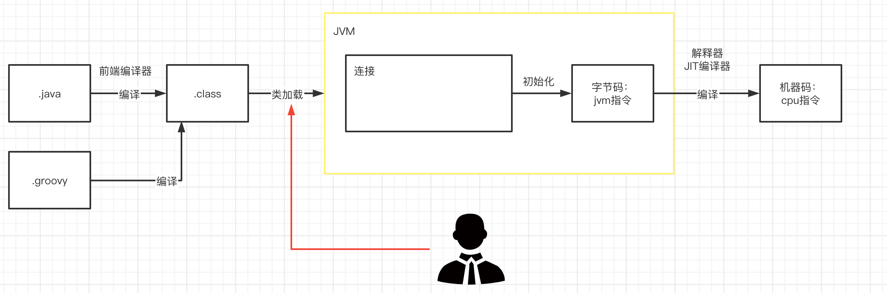
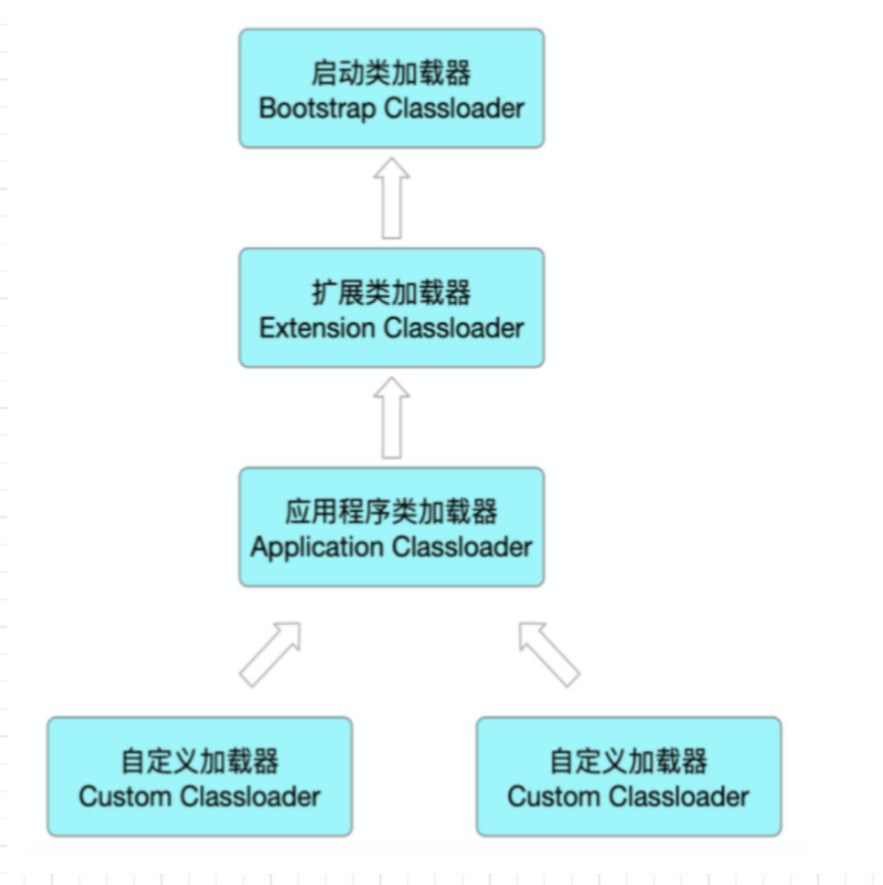

<!-- more -->

## 1 知识体系

## 2 问题

### 2.1 什么是类加载？

### 2.2 有哪些类加载器？

### 2.3 什么是双亲委派？Tomcat如何打破？

###  2.4 如何自定义类加载器？自定义类加载器的应用场景是什么？

### 2.5 操作字节码有哪些技术？在什么场景下会用到？

### 2.6 Groovy中定义了哪些类加载器？

- RootLoader：管理了Groovy的classpath，负责加载Groovy及其依赖的第三方库中的类，它不是使用双亲委派模型。
- GroovyClassLoader：负责在运行时编译groovy源代码为Class的工作，从而使Groovy实现了将groovy源代码动态加载为Class的功能。
- GroovyClassLoader.InnerLoader：Groovy脚本类的直接ClassLoader，它将加载工作委派给GroovyClassLoader，它的存在是为了支持不同源码里使用相同的类名，以及加载的类能顺利被GC。

Spring Context 中有  org.springframework.scripting.groovy.GroovyScriptFactory 类

## 3 参考

